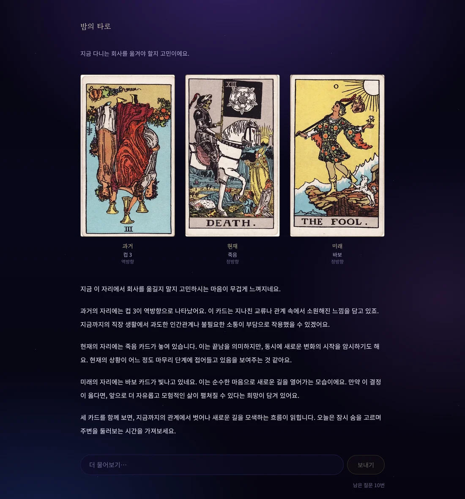
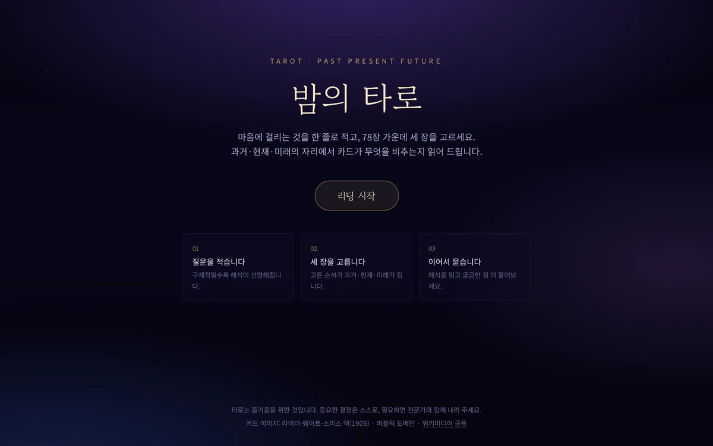
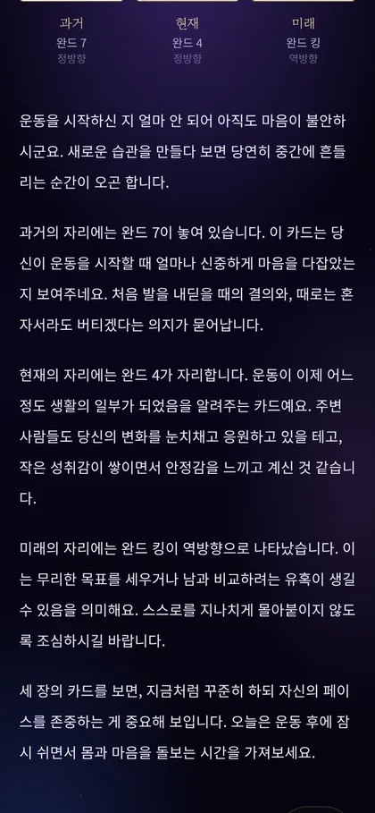

# 밤의 타로 · Taro reading with LLM

고민을 한 줄 적고 78장 가운데 세 장을 고르면, LLM이 과거·현재·미래의 자리로 카드를 읽어 주는 웹 타로 리딩입니다. 해석을 읽은 뒤에는 같은 카드를 놓고 이어서 질문할 수 있습니다.

An AI tarot reading web app: pick three of 78 cards, get a streamed past/present/future reading from an LLM (EXAONE on vLLM, Claude, or a built-in demo reader), then ask follow-up questions.

<p align="center">
  
</p>
<p align="center">
  
  &nbsp;
  
</p>

## 주요 기능

- **3카드 스프레드** — 뒷면 78장 그리드에서 고른 순서가 과거·현재·미래가 되고, 각 카드는 35% 확률로 역방향이 됩니다.
- **스트리밍 해석** — 카드가 뒤집히는 동안 해석이 한 글자씩 흘러나옵니다. 첫 글자까지 0.1초 안팎(EXAONE, A100 기준).
- **후속 대화** — 해석을 읽은 뒤 같은 카드를 두고 최대 10번 더 물어볼 수 있습니다.
- **모델 교체** — EXAONE(vLLM)·Claude·데모 대역이 같은 인터페이스를 따릅니다. 아무 설정이 없어도 데모 대역으로 끝까지 동작합니다.
- **연출** — 깊은 밤과 금색 톤, 라이더-웨이트-스미스(1909) 실사 카드, 셔플·뒤집기 애니메이션. `prefers-reduced-motion`을 존중합니다.

## 기술 스택

| 영역 | 사용 |
|---|---|
| 앱 | Next.js 16 (App Router) · React 19 · TypeScript · Tailwind CSS 4 · Motion |
| 서버 | Next.js Route Handler · zod 요청 검증 · 텍스트 스트리밍 |
| 모델 | EXAONE 4.0.1 32B on vLLM 0.30 (OpenAI 호환 API) · Anthropic SDK · 데모 대역 |
| 테스트 | Vitest · Playwright |

## 빠른 시작

GPU나 API 키 없이 데모 대역으로 돌려 볼 수 있습니다.

```bash
npm install
npm run dev           # http://localhost:3000
```

카드 이미지(`public/cards/`)는 저장소에 들어 있습니다. 다시 받으려면 `npm run fetch:cards`.

실제 모델을 붙이는 방법은 두 가지입니다 — [EXAONE을 직접 띄우기](#exaone으로-실행하기)(GPU 필요) 또는 [Claude API 키](#해석을-맡는-모델).

## EXAONE으로 실행하기

LG AI연구원의 [EXAONE 4.0.1 32B](https://huggingface.co/LGAI-EXAONE/EXAONE-4.0.1-32B)를 vLLM으로 띄워 붙입니다. 한국어가 자연스럽고, 4.0.1은 부적절한 응답을 줄인 패치 버전입니다.

**필요한 것**: conda, CUDA 12.x를 돌리는 NVIDIA 드라이버(570에서 확인), 80GB GPU 한 장(또는 40GB 두 장), 디스크 약 76GB(가중치 64GB + 환경 12GB).

```bash
npm run setup:exaone          # 전용 conda 환경 taro-exaone을 만들고 vLLM을 설치합니다 (한 번만)
npm run serve:exaone          # 첫 실행은 가중치 64GB를 받습니다. "Application startup complete"가 뜨면 준비 완료
```

다른 터미널에서:

```bash
echo 'LLM_BASE_URL=http://127.0.0.1:8765/v1' >> .env.local
npm run dev
```

화면 오른쪽 위에 "데모 모드" 배지가 없으면 EXAONE이 답하고 있는 것입니다.

| 스크립트 변수 | 기본값 | 설명 |
|---|---|---|
| `GPUS` | `0` | `GPUS=2`처럼 고르거나 `GPUS=0,1`로 두 장에 나눕니다(텐서 병렬) |
| `PORT` | `8765` | 8000번대는 다른 서비스와 겹치기 쉬워 피했습니다 |
| `ENV_NAME` | `taro-exaone` | vLLM이 설치된 conda 환경 이름 (설정·서빙 스크립트 공통) |

EXAONE 4.0은 비추론 모드에서 temperature 0.6 미만을 권하는데, 모델의 `generation_config.json`에는 샘플링 값이 없습니다. 그래서 서빙 스크립트가 vLLM에 기본값(temperature 0.5, top_p 0.95)을 겁니다. 앱은 범용 OpenAI 호환 클라이언트라 모델별 값을 들고 있지 않습니다.

**A100 80GB 한 장에서 잰 값**: 기동은 처음 약 2분(torch.compile), 이후 약 1분(컴파일 캐시). 첫 글자까지 0.1초 안팎, 초당 약 43자로 해석 한 편(500자 안팎)이 10~15초, 동시 8건 생성에 15~18초.

- 모델 서버는 `127.0.0.1`에만 엽니다. 인증 없는 모델을 공용 서버의 네트워크에 노출하지 않기 위해서입니다. 원격 서버에서 돌린다면 SSH나 VS Code 포트 전달로 접속하세요.
- 사용자가 읽다가 페이지를 떠나면 스트림을 취소해, GPU가 쓸모없는 토큰을 계속 만들지 않게 합니다.
- 모델이 GPU 서버에서만 돌기 때문에 Vercel 같은 곳에 배포한 앱에는 붙지 않습니다. 배포본은 데모 모드나 Claude로 동작합니다.

## 해석을 맡는 모델

`lib/llm/provider.ts`가 위에서부터 먼저 설정된 것을 고릅니다. 설정은 `.env.local`에 둡니다(`.env.example` 참고).

| 순서 | 조건 | 쓰는 것 |
|---|---|---|
| 1 | `ANTHROPIC_API_KEY` | Claude (`ANTHROPIC_MODEL`, 기본 `claude-sonnet-5`) |
| 2 | `LLM_BASE_URL` | OpenAI 호환 서버 — EXAONE(vLLM), Ollama, Gemini 등 |
| 3 | 없음 | 데모 대역 — 카드 키워드를 엮어 해석을 만들고 스트리밍처럼 흘려보냄 |

| OpenAI 호환 서버용 변수 | 기본값 | 설명 |
|---|---|---|
| `LLM_BASE_URL` | — | 예: `http://127.0.0.1:8765/v1` |
| `LLM_MODEL` | `exaone` | 서버에 등록된 모델 이름 |
| `LLM_API_KEY` | — | 필요한 서버만. `Authorization: Bearer`로 보냅니다 |
| `LLM_TEMPERATURE` | 서버 기본값 | 비워 두면 보내지 않습니다. EXAONE은 서빙 스크립트가 서버 쪽 기본값(0.5)을 겁니다 |

키와 주소는 서버에서만 읽고 브라우저로 나가지 않습니다.

## 동작 방식

```
브라우저                              Next.js 서버                          모델
───────────────────────────────       ─────────────────────────────         ──────────────────
질문 입력 → 78장 셔플 → 3장 선택  ─▶  /api/reading, /api/chat
                                      · 레이트 리밋 (IP당 10분 20회)
                                      · zod 검증 — 카드 id를 덱과 대조  ─▶  ReadingProvider
해석을 받는 대로 화면에 쌓음      ◀─  · 텍스트 스트림                  ◀─   ├ Claude
                                                                             ├ OpenAI 호환 (EXAONE)
                                                                             └ 데모 대역
```

- **뽑기는 클라이언트, 검증은 서버.** 셔플과 선택은 연출 때문에 브라우저에서 하지만, 서버는 넘어온 카드 id·자리·중복을 덱과 대조해 다시 검증합니다.
- **서버는 무상태.** 후속 질문마다 클라이언트가 질문·카드·첫 해석·후속 대화를 함께 보냅니다. 첫 해석은 대화 턴이 아니라 고정된 맥락으로 따로 보내서, 대화가 길어져 오래된 턴을 잘라 내도(최근 12개) 해석은 남습니다. 후속 질문은 10번까지입니다.
- **프롬프트는 한 곳에서.** `lib/llm/prompts.ts`가 첫 해석과 후속 답변의 시스템 프롬프트와 메시지를 만들고, 각 프로바이더는 받아서 보내기만 합니다.
- **실패해도 흔적을 남기지 않음.** 후속 답변이 한 글자도 오지 않으면 그 질문을 대화에서 거두고 입력창에 돌려놓습니다. 빈 말풍선이 남거나 질문 횟수가 헛되이 줄지 않습니다.

```
app/
  page.tsx · reading/page.tsx     랜딩 · 리딩 페이지
  api/reading · api/chat          첫 해석 · 후속 답변 스트리밍
components/
  ReadingFlow.tsx                 질문 → 선택 → 해석 흐름과 상태
  CardGrid · SpreadBoard          뒷면 78장 그리드 · 3카드 배치와 뒤집기
  ReadingStream · ChatPanel       해석 · 후속 대화 (ModelText로 같은 방식으로 문단을 나눔)
lib/
  tarot/                          78장 덱 · 셔플과 뽑기 · 이미지 출처 파일명
  llm/                            프로바이더(Claude · OpenAI 호환 · 데모) · 프롬프트 · SSE 파서
  schema.ts · http.ts             요청 검증 · 레이트 리밋과 검증을 묶은 관문 · 텍스트 스트림
  korean.ts · text.ts             한국어 조사 · 문단 나누기
scripts/
  setup-exaone-env.sh · serve-exaone.sh · lib/exaone-env.sh    EXAONE 전용 환경과 서빙
  fetch-cards.ts                  카드 이미지 수집
```

## 테스트

```bash
npm test          # Vitest — 덱·뽑기·요청 검증·프롬프트·한국어 조사·스트림·SSE 파서·모델 선택·레이트 리밋
npm run test:e2e  # Playwright — 랜딩부터 후속 대화까지
```

e2e는 모델 설정(`ANTHROPIC_API_KEY`, `LLM_BASE_URL`)을 비운 프로덕션 빌드를 띄워 데모 대역으로 고정합니다. 그래서 `.env.local`에 EXAONE이 있어도 결정적으로 돌아갑니다. `prefers-reduced-motion` 환경에서도 같은 흐름을 한 번 더 검증합니다.

처음 실행한다면 브라우저와 시스템 라이브러리가 필요합니다.

```bash
npx playwright install chromium
npx playwright install-deps chromium   # sudo 필요
```

## 개발 노트

### EXAONE에 맞춰 프롬프트 다듬기

EXAONE으로 해석 8편과 후속 답변 8편을 동시에 뽑아 형식을 자동으로 채점하며 고쳤습니다.

| 증상 | 원인 | 고친 방법 | 고친 뒤 (8편 중) |
|---|---|---|---|
| 세 장을 한 문단에 몰아 씀, 자리 이름 빠짐 | "한 장씩 한 단락" 정도의 느슨한 지시 | 다섯 문단과 각 문단 첫머리("과거의 자리에는"…)를 못 박음 | 형식 준수 8편 |
| 첫 줄이 `질문: …`으로 시작 | 넘겨준 메시지의 `질문:` 라벨을 따라 함. "라벨을 쓰지 말라"고 적자 오히려 8편 모두로 번짐 | 라벨을 없애고 질문을 따로 한 줄로 넘김 | 발생 0편 |
| 첫 문장이 따옴표로 감싸짐 | 질문을 따옴표로 감싸 넘긴 것을 따라 함 | 따옴표 없이 넘김 | 발생 0편 |
| 후속 질문에 세 장을 처음부터 다시 풀이 | 첫 해석용 형식 지시가 섞인 한 프롬프트, 그리고 대화 턴으로 들어간 다섯 문단짜리 해석 | 후속 답변용 시스템 프롬프트를 분리하고, 첫 해석은 고정 맥락으로 옮기고, 마지막 질문 뒤에 짧은 안내를 서버에서만 덧붙임 | 짧은 직답 1편 → 8편 |
| 후속 질문 7번째부터 첫 해석을 잊음 | 해석이 대화 턴이라 오래된 턴을 자를 때 함께 잘려 나감 | 해석을 대화 턴이 아닌 고정 맥락으로 넘김 | 7번째 질문에도 첫 해석의 카드를 기억 |

각 결정은 이유와 함께 `lib/llm/prompts.test.ts`에 테스트로 남겨 두었습니다.

### vLLM을 전용 환경에 격리하기

처음엔 다른 연구용 conda 환경의 vLLM을 빌려 썼는데, 그 환경의 flashinfer 버전 불일치 때문에 우회책을 덧대야 했습니다. 그래서 `scripts/setup-exaone-env.sh`가 전용 환경을 만들고, `scripts/serve-exaone.sh`가 그 환경만 쓰도록 격리합니다. 격리하면서 드러난 문제와 대응은 다음과 같습니다.

| 문제 | 대응 |
|---|---|
| vLLM 기본 휠은 CUDA 13 빌드라 드라이버 580 이상이 필요함 | CUDA 12.x 드라이버에서 도는 `+cu129` 빌드를 설치 |
| 셸에 켜 둔 다른 conda 환경의 옛 nvcc가 flashinfer 컴파일에 끼어듦 | 서빙할 때 다른 conda 경로를 PATH에서 빼고 이 환경만 앞에 둠 |
| 시스템 nvcc(12.4)도 flashinfer가 넘기는 옵션을 모름 | 처음 쓸 때 컴파일되는 FlashInfer 샘플러를 끄고 PyTorch 샘플러 사용 |
| pip 휠이 시스템의 옛 libstdc++를 먼저 물어, 환경의 SQLite→ICU가 새 C++ 런타임을 못 찾음 | 환경의 libstdc++를 먼저 올림 (`LD_PRELOAD`) |

설정 스크립트는 서버가 실제로 밟는 임포트 경로(`vllm`, `sqlite3`)를 같은 조건에서 불러 보고 GPU에 텐서까지 올려 본 뒤에야 "완료"를 출력합니다. 다시 실행하면 설치는 건너뛰고 검사만 합니다.

## 알려진 한계

- **레이트 리밋이 인스턴스별입니다.** 메모리에 IP별 요청 시각을 담기 때문에, 서버리스에서는 인스턴스마다 따로 셉니다. 데모 규모에서 의도한 절충이고, 실제 서비스라면 Redis 같은 공유 저장소로 옮겨야 합니다.
- **리딩 기록을 저장하지 않습니다.** 새로고침하면 처음으로 돌아갑니다.
- **EXAONE은 GPU 서버에서만 돕니다.** 배포본에는 붙지 않습니다.

## 라이선스와 출처

- **코드**: [Apache License 2.0](LICENSE)
- **카드 이미지**: 라이더-웨이트-스미스 덱(1909, Pamela Colman Smith 그림)은 퍼블릭 도메인입니다. [위키미디어 공용](https://commons.wikimedia.org/wiki/Category:Rider-Waite_tarot_deck)에서 받아 폭 600px webp로 변환했습니다(`scripts/fetch-cards.ts`).
- **EXAONE 모델**: 가중치는 이 저장소에 들어 있지 않으며, [EXAONE AI Model License Agreement 1.2 - NC](https://huggingface.co/LGAI-EXAONE/EXAONE-4.0.1-32B)를 따릅니다. 비상업 용도만 허용됩니다.

---

타로는 즐거움을 위한 것입니다. 이 앱은 운세를 단정하지 않으며, 중요한 결정은 스스로, 필요하면 전문가와 함께 내리시길 권합니다.
