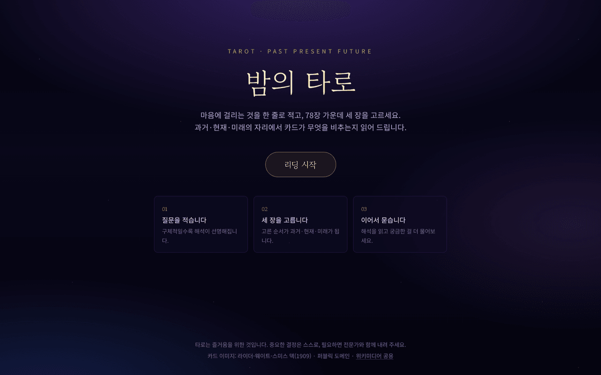
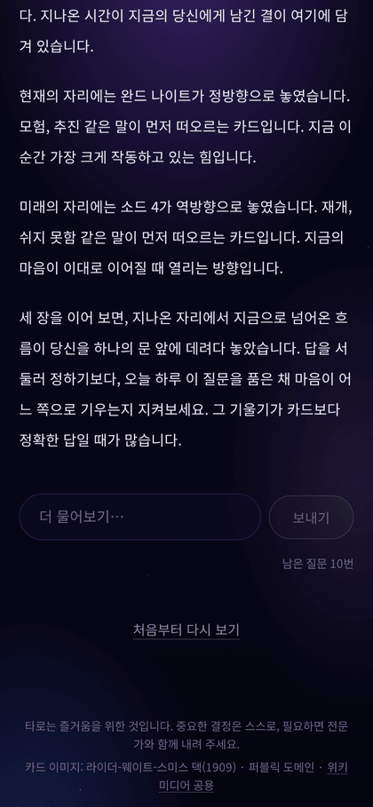

# 밤의 타로

고민을 한 줄 적고 78장 가운데 세 장을 고르면, AI가 과거·현재·미래의 자리로 읽어 주는 웹 타로 리딩입니다. 해석을 읽은 뒤 같은 카드를 놓고 이어서 질문할 수 있습니다.

<p align="center">
  
  &nbsp;
  
</p>

## 흐름

질문 입력 → 뒷면 78장 그리드에서 세 장 선택 → 카드가 뒤집히며 스프레드 완성 → 해석이 스트리밍으로 흐름 → 이어서 질문

고른 순서가 그대로 **과거 · 현재 · 미래**가 되고, 각 카드는 35% 확률로 역방향이 됩니다.

## 빠른 시작

```bash
npm install
npm run fetch:cards   # 카드 이미지 78장을 위키미디어 공용에서 내려받습니다
npm run dev           # http://localhost:3000
```

API 키가 없어도 전체 흐름이 끝까지 동작합니다(데모 모드). 실제 모델을 쓰려면:

```bash
cp .env.example .env.local
# .env.local 에 ANTHROPIC_API_KEY 를 채웁니다
npm run dev
```

| 환경 변수 | 설명 |
|---|---|
| `ANTHROPIC_API_KEY` | 있으면 실제 모델, 없으면 데모 프로바이더가 응답합니다 |
| `ANTHROPIC_MODEL` | 기본값 `claude-sonnet-5` |

키는 서버에서만 읽고 브라우저로 나가지 않습니다. 모든 호출은 `/api/reading`, `/api/chat` 라우트를 거칩니다.

## 데모 모드

`ANTHROPIC_API_KEY`가 비어 있으면 `lib/llm/demo.ts`가 카드 키워드를 엮어 해석을 만들고, 실제 스트리밍처럼 조금씩 흘려보냅니다. 화면 오른쪽 위에 **데모 모드** 배지가 뜹니다. 배포된 데모가 키 없이도, 한도를 넘겨도 늘 동작하게 하려는 장치입니다.

두 구현은 `lib/llm/types.ts`의 `ReadingProvider` 인터페이스를 공유하므로 다른 모델로 바꾸려면 구현 하나만 더 쓰면 됩니다.

## 카드 이미지

라이더-웨이트-스미스 덱(1909, Pamela Colman Smith 그림)은 퍼블릭 도메인입니다. `npm run fetch:cards`가 [위키미디어 공용](https://commons.wikimedia.org/wiki/Category:Rider-Waite_tarot_deck)에서 78장을 받아 폭 600px webp로 `public/cards/<카드-id>.webp`에 저장합니다.

- 이미 받은 파일은 건너뜁니다. 다시 받으려면 `npm run fetch:cards -- --force`
- 위키미디어가 429를 돌려주면 스크립트가 `Retry-After`를 보고 기다렸다 재시도합니다. 그래도 몇 장이 빠지면 한 번 더 실행하면 채워집니다.
- 네트워크가 막힌 환경이라면 위 카테고리에서 직접 받아 같은 이름으로 넣어도 됩니다. 파일명 규칙은 `lib/tarot/wikimedia.ts`에 있습니다.

카드 **뒷면**은 이미지 없이 CSS로 그렸습니다(`.card-back` in `app/globals.css`).

## 테스트

```bash
npm test          # vitest — 덱·뽑기·스키마·프롬프트·조사·스트림·레이트리밋
npm run test:e2e  # playwright — 랜딩부터 후속 대화까지
```

e2e는 `ANTHROPIC_API_KEY`를 비운 채 프로덕션 빌드를 띄워 데모 프로바이더로 고정하므로 결정적으로 돌아갑니다. 애니메이션을 줄인 환경(`prefers-reduced-motion`)에서도 같은 흐름을 한 번 더 검증합니다.

처음 실행한다면 브라우저와 시스템 라이브러리가 필요합니다:

```bash
npx playwright install chromium
npx playwright install-deps chromium   # sudo 필요
```

## 알려진 한계

- **레이트 리밋이 인스턴스별입니다.** `lib/rateLimit.ts`는 메모리에 IP별 요청 시각을 담습니다(10분에 20회). 서버리스에서는 인스턴스마다 따로 세므로 완전한 방어가 아닙니다. 데모 규모에서 의도한 절충이며, 실제 서비스라면 Redis 같은 공유 저장소로 옮겨야 합니다.
- **리딩 기록을 저장하지 않습니다.** 서버는 무상태이고 브라우저에도 남기지 않습니다. 새로고침하면 처음으로 돌아갑니다.
- **후속 질문은 한 리딩당 10번까지**이고, 매 요청에 최근 12개 메시지만 실어 보냅니다(`lib/schema.ts`).

## 구조

```
app/
  page.tsx                  랜딩
  reading/page.tsx          리딩 페이지
  api/reading/route.ts      첫 해석 스트리밍
  api/chat/route.ts         후속 대화 스트리밍
components/
  ReadingFlow.tsx           질문 → 선택 → 해석 상태 머신
  CardGrid.tsx              뒷면 78장 그리드
  SpreadBoard.tsx           3카드 배치와 뒤집기
  ReadingStream.tsx         스트리밍 해석
  ChatPanel.tsx             후속 대화
lib/
  tarot/deck.ts             78장 메타데이터
  tarot/draw.ts             셔플과 뽑기
  tarot/wikimedia.ts        이미지 출처 파일명
  llm/                      프로바이더 인터페이스 · Anthropic · 데모 · 프롬프트
  schema.ts                 요청 검증
  korean.ts                 조사 선택
  rateLimit.ts              IP 슬라이딩 윈도우
scripts/fetch-cards.ts      이미지 수집
```

뽑기는 연출 때문에 클라이언트에서 하고, 서버는 넘어온 카드 id를 덱과 대조해 다시 검증합니다.

## 배포

Vercel에 연결하고 `ANTHROPIC_API_KEY`를 환경 변수로 넣으면 됩니다. 키를 넣지 않으면 배포본은 데모 모드로 동작합니다. `public/cards/`는 저장소에 포함돼 있어 빌드 중에 네트워크를 타지 않습니다.

---

타로는 즐거움을 위한 것입니다. 이 앱은 운세를 단정하지 않으며, 중요한 결정은 스스로, 필요하면 전문가와 함께 내리시길 권합니다.
